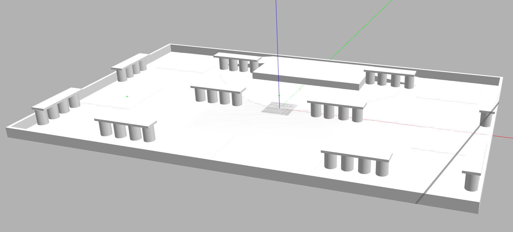
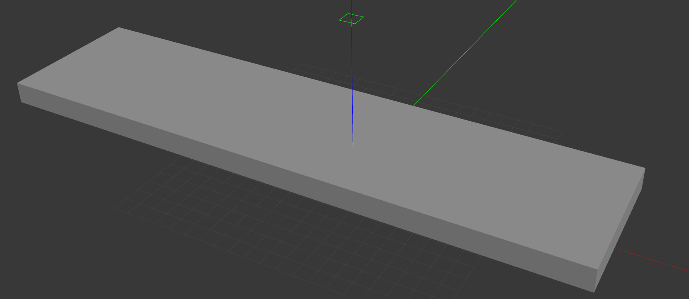
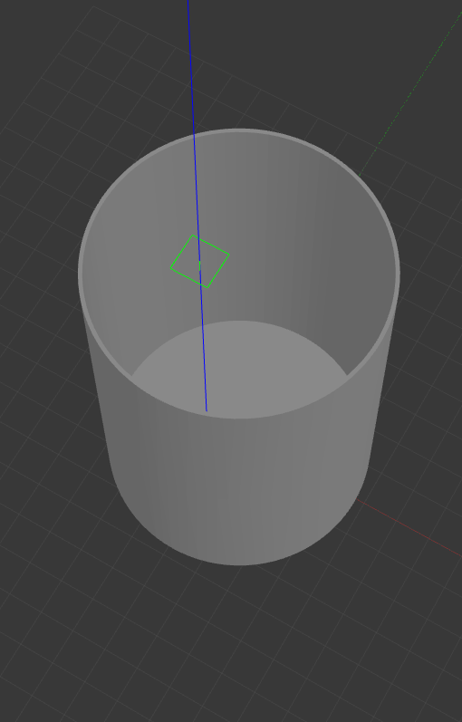

# Playmat for Eurobot'25 in Gazebo

This repository contains a Gazebo simulation of the playmat for Eurobot 2025. It includes the world file and necessary models to visualize the playmat. Follow the instructions below to set up and run the simulation.

**Please note:**
1. The current world is tested ONLY on Gazebo11 Classic. I'll be adding support for newer versions if required.
2. The columns and platforms are currently static (you can't move/pick them up!). I'll be adding physics/collisions to it soon.

Playmat'25 model            |
:-------------------------:|
 

Platform model             | Column model
:-------------------------:|:-------------------------:
  |  

## 1. Install Gazebo
To use this project, you need to install Gazebo11. Follow the official installation guide based on your operating system:
- **Gazebo Classic (Gazebo 11)**: [Installation Guide](https://classic.gazebosim.org/tutorials?cat=install)

## 2. Setting Up the Model Path
Gazebo needs to know where to find the models in this repository. There are two ways to set it up:

### **Option 1: Copy Models to Gazebo’s Default Directory**
Move the models from this repository to `~/.gazebo/models/`:
```bash
mkdir -p ~/.gazebo/models/
cp -r models/* ~/.gazebo/models/
```

### **Option 2: Set a Custom Model Path in Bashrc**
If you want to keep the models inside this repository without copying them, set the `GAZEBO_MODEL_PATH` environment variable:
```bash
echo 'export GAZEBO_MODEL_PATH=$GAZEBO_MODEL_PATH:$(pwd)/models' >> ~/.bashrc
source ~/.bashrc
```
> Replace `$(pwd)/models` with the absolute path to the `models/` directory if needed.

## 3. Running the World in Gazebo
Once the models are properly set up, `cd` to the repo root and launch the Gazebo world with:
```bash
gazebo worlds/playmat.world
```
